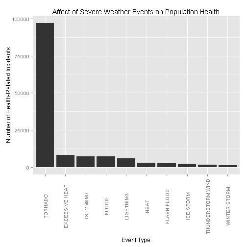
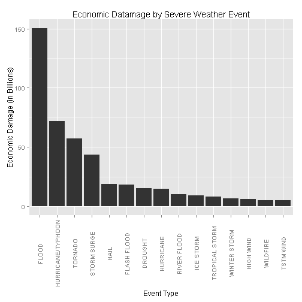

# Impacts of Severe Weather on Economy and Health

#### by Aleksey Kramer, *Mon Jan 12 18:15:58 2015*

## Synopsis

This report uses National Oceanic and Atmospheric Administration's database of severe weather events. The dataset available for analysis contains the data collected between years of 1950 and 2011. This report identifies the most harmful weather events with respect to economic impact and population health impact.  The findings of this report indicate that tornados and floods are the most harmful to human population and the most expensive respectfully.  This report also produces a graph of most impactful weather events in descending order for both, heath and economic impacts of the severe weather events.

#### Data Seelectd for Analysis

The data selected for analysis was downloaded from [Storm Data]( https://d396qusza40orc.cloudfront.net/repdata%2Fdata%2FStormData.csv.bz2).  The description of the dataset was downloaded from the [Storm Data Documentation]( https://d396qusza40orc.cloudfront.net/repdata%2Fpeer2_doc%2Fpd01016005curr.pdf). The variables used in this report are: *PROPDMG*, *PROPDMGEXP*, *CROPDMG*, *CROPDMGEXP*, *EVTYPE*, *INJURIES*, *FATALITIES*.  It is assumed that PROPDMG and CROPDMG variables are sufficient indicators of the economic impact, while INJURIES and FATALITIES were sufficient indicator of population's health impact.

## Data Processing

Load libraries for data plotting


```r
library(ggplot2)
```

Download data from the web if not already downloaded


```r
if (file.exists("repdata_data_StormData.csv.bz2") & file.exists("repdata_peer2_doc_pd01016005curr.pdf")) {
    print("Using already downloaded data")
} else {
    data_url <- "https://d396qusza40orc.cloudfront.net/repdata%2Fdata%2FStormData.csv.bz2"
    download.file(data_url, "repdata_data_StormData.csv.bz2", mode="wb")
    
    doc_url <- "https://d396qusza40orc.cloudfront.net/repdata%2Fpeer2_doc%2Fpd01016005curr.pdf"
    download.file(doc_url, "repdata_peer2_doc_pd01016005curr.pdf", mode="wb")
}
```

Load the data into the data frame and selecting the subset of variables, namly *PROPDMG*, *PROPDMGEXP*, *CROPDMG*, *CROPDMGEXP*, *EVTYPE*, *INJURIES*, *FATALITIES* that is used for the analysis.


```r
my_file <- bzfile("repdata_data_StormData.csv.bz2", "r")
data <- read.csv(my_file, stringsAsFactors = FALSE)
close(my_file)

# Subset the data needed for analysis
data <- data[, c("PROPDMG", "PROPDMGEXP", "CROPDMG", "CROPDMGEXP", "EVTYPE", "INJURIES", "FATALITIES")]

# Make EVTYPE to be factor variable
data$EVTYPE <- as.factor(data$EVTYPE)
```

### Across the United States, which types of events (as indicated in the *EVTYPE* variable) are most harmful with respect to population health?

To determine the most harmful sever weather events with respect for human population, the variables *INJURIES*, *FATALITIES*, and *EVTYPE* are used. It is assumed that these variable provide sufficient indicator on which severe weather events are most harmful. We start with aggregating  combining *INJURIES* and *FATALITIES* by *EVTYPE* to be used in analysis.


```r
# INJURIES
injuries <- data[, c("EVTYPE", "INJURIES")]
injuries <- aggregate(injuries$INJURIES, by=list(injuries$EVTYPE), FUN=sum, rm.na=TRUE)
colnames(injuries) <- c("EVTYPE", "INJURIES")

# FATALITIES
fatalities <- data[, c("EVTYPE", "FATALITIES")]
fatalities <- aggregate(fatalities$FATALITIES, by=list(fatalities$EVTYPE), FUN=sum, rm.na=TRUE)
colnames(fatalities) <- c("EVTYPE", "FATALITIES")
```

Create the data frame called *himpact* by merging *injuries* and *fatalities* data frame by *EVTYPE*. Store the sum of *FATALITIES* and *INJURIES* variables into single variable called *TOTAL*.  


```r
himpact <- merge(injuries,fatalities,by="EVTYPE")
himpact$TOTAL <- himpact$INJURIES + himpact$FATALITIES
```

Sort the data frame in descending order and reduce the number of rows to be displayed.


```r
himpact <- himpact[with(himpact, order(-TOTAL)),]

# Selecting only largest 5 rows to plot
himpact <- himpact[1:10,]
```

Assure the data is sorted for plotting in descending order by *TOTAL*


```r
himpact <- transform(himpact, EVTYPE = reorder(EVTYPE, order(TOTAL, decreasing=TRUE)))
```

Display the data fram to be plotted

```r
# Showing final data set that will be plotted
head(himpact, 10)
```

```
##                EVTYPE INJURIES FATALITIES TOTAL
## 834           TORNADO    91347       5634 96981
## 130    EXCESSIVE HEAT     6526       1904  8430
## 856         TSTM WIND     6958        505  7463
## 170             FLOOD     6790        471  7261
## 464         LIGHTNING     5231        817  6048
## 275              HEAT     2101        938  3039
## 153       FLASH FLOOD     1778        979  2757
## 427         ICE STORM     1976         90  2066
## 760 THUNDERSTORM WIND     1489        134  1623
## 972      WINTER STORM     1322        207  1529
```

Create a plot of *himpact@TOTAL* by *ehmpact@EVTYPE*. The plot denotes occurances of injures of death due to severe weather events. The rest of the dataset is not plotted due other severe weather events causing significantly diminishing effect on population health.


```r
# Graph himpact$EVTYPE vs himpact$TOTAL using ggplot2 nicely
ggplot(himpact, aes(EVTYPE, TOTAL)) + geom_bar(stat="identity") + xlab("Event Type") +
    ylab("Number of Health-Related Incidents") + 
    ggtitle("Affect of Severe Weather Events on Population Health") +
    theme(axis.text.x=element_text(angle=90, vjust=0.5)) 
```

 

### Across the United States, which types of events have the greatest economic consequences?

Prepare two data frames to hold the values of property damange *(PROPDMG)* and crop damaage *(CROPDMG)*. At the same time, remove incomplete records.


```r
propdmg <- data[, c("EVTYPE", "PROPDMG", "PROPDMGEXP")]
propdmg <- na.omit(propdmg)
cropdmg <- data[, c("EVTYPE", "CROPDMG", "CROPDMGEXP")]
cropdmg <- na.omit(cropdmg)
```

Change all the exponent indicators to upper case to make sure all the exponents are accounted for later when processing exponents.


```r
propdmg[, "PROPDMGEXP"] <- toupper(propdmg[, "PROPDMGEXP"])
cropdmg[, "CROPDMGEXP"] <- toupper(cropdmg[, "CROPDMGEXP"])
```

Create a function that translates character value of the *PROPDMGEXP* and *CROPDMGEXP* into numeric exponents.


```r
transf_exp <- function(exp) {
    if (exp %in% c("H"))
        return(2)
    else if (exp %in% c("K"))
        return(3)
    else if (exp %in% c("M"))
        return(6)
    else if (exp %in% c("B"))
        return(9)
    else if (suppressWarnings(!is.na(as.numeric(exp))))
        return(suppressWarnings(as.numeric(exp)))
    else {
        return(0)
    }
}
```

Use *transf_exp()* function written above, update the *PROPDMG* and *CROPDMG* variables to show real numbers (normalize data).


```r
# propdmg
exponent <- sapply(propdmg$PROPDMGEXP, FUN=transf_exp)
propdmg$PROPDMG <- propdmg$PROPDMG * (10 ** exponent)
propdmg$EVTYPE <- as.factor(propdmg$EVTYPE)
propdmg <- aggregate(propdmg$PROPDMG, by=list(propdmg$EVTYPE), FUN=sum, rm.na=TRUE)
colnames(propdmg) <- c("EVTYPE", "PROPDMG")

# cropdmg
exponent <- sapply(cropdmg$CROPDMGEXP, FUN=transf_exp)
cropdmg$CROPDMG <- cropdmg$CROPDMG * (10 ** exponent)
cropdmg$EVTYPE <- as.factor(cropdmg$EVTYPE)
cropdmg <- aggregate(cropdmg$CROPDMG, by=list(cropdmg$EVTYPE), FUN=sum, rm.na=TRUE)
colnames(cropdmg) <- c("EVTYPE", "CROPDMG")
```

Create economic impact data frame called *eimpact* and buil variable *TOTAL* to hold the sum of two ammounts: property damage and crop damage.


```r
eimpact <- merge(propdmg,cropdmg,by="EVTYPE")
eimpact$TOTAL <- eimpact$PROPDMG + eimpact$CROPDMG
```

Sort the data frame in descending order and reduce the number of rows to be displayed.


```r
eimpact <- eimpact[with(eimpact, order(-TOTAL)),]

# Selecting only largest 5 rows to plot
eimpact <- eimpact[1:15,]

# Divide total by 1 billion to better rerpesent on the plot
eimpact$TOTAL <- eimpact$TOTAL / 1000000000
```

Prepare *eimpact* data frame for plotting by assuring that the data frame is sorted in descending order by variablle *TOTAL*. Only first fifteen records are selected due to significant diminishing of hte impact and the ease of presentation.


```r
eimpact <- transform(eimpact, EVTYPE = reorder(EVTYPE, order(TOTAL, decreasing=TRUE)))

# Showi final data set that will be plotted
head(eimpact, 15)
```

```
##                EVTYPE   PROPDMG   CROPDMG   TOTAL
## 170             FLOOD 1.447e+11 5.662e+09 150.320
## 411 HURRICANE/TYPHOON 6.931e+10 2.608e+09  71.914
## 834           TORNADO 5.695e+10 4.150e+08  57.362
## 670       STORM SURGE 4.332e+10 5.001e+03  43.324
## 244              HAIL 1.574e+10 3.026e+09  18.761
## 153       FLASH FLOOD 1.682e+10 1.421e+09  18.244
## 95            DROUGHT 1.046e+09 1.397e+10  15.019
## 402         HURRICANE 1.187e+10 2.742e+09  14.610
## 590       RIVER FLOOD 5.119e+09 5.029e+09  10.148
## 427         ICE STORM 3.945e+09 5.022e+09   8.967
## 848    TROPICAL STORM 7.704e+09 6.783e+08   8.382
## 972      WINTER STORM 6.688e+09 2.694e+07   6.715
## 359         HIGH WIND 5.270e+09 6.386e+08   5.909
## 957          WILDFIRE 4.765e+09 2.955e+08   5.061
## 856         TSTM WIND 4.485e+09 5.540e+08   5.039
```

Create a plot of *eimpact@TOTAL* by *eimpact@EVTYPE*. The plot denotes monetary impact in *BILLIONS* of severe weather events on economy. The rest of the dataset is not plotted due other severe weather events causing significantly diminishing monetary impact on the economy.


```r
ggplot(eimpact, aes(EVTYPE, TOTAL)) + geom_bar(stat="identity") + xlab("Event Type") +
    ylab("Economic Damage (in Billions)") + ggtitle("Economic Datamage by Severe Weather Event") +
    theme(axis.text.x=element_text(angle=90, vjust=0.5)) 
```

 

## Results

According to the analysis, top 5 most harmful sever weather events with respect to economy are:

1. Flood
2. Hurricane/Typhoon
3. Torndado
4. Storm Surge
5. Hail

Analysis also indicates that top 5 most harmful severe weather events wit respect to population health are:

1. Tornado
2. Excessive Heat
3. MSTM Wind
4. Flood
5. Lightning
